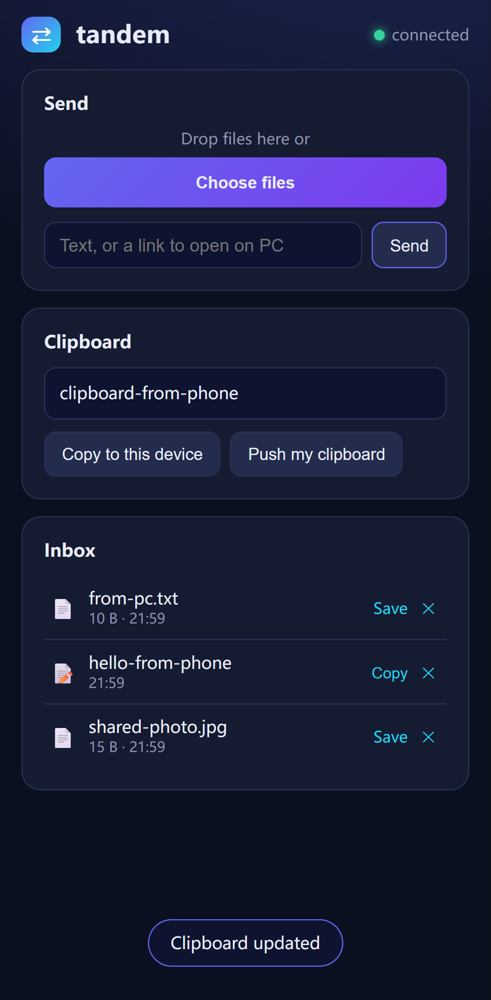

# Tandem (˶ᵔᵕᵔ˶)

**AirDrop for every device — your phone doesn't even have to switch Wi-Fi.**

Send files, clipboard and links between Android, iOS, Windows, macOS and Linux. One tiny hub runs on your computer; pairing happens over **Bluetooth** — no Wi-Fi juggling, no certificate installs, no cloud.

[中文文档](README.zh-CN.md)

<p align="center"></p>

## Why Tandem

| | Tandem | LocalSend | KDE Connect | AirDrop | Vendor apps |
|---|---|---|---|---|---|
| Pairing touches Wi-Fi? | **No — BLE** | same-net | same-net | — | yes |
| Re-pair after restart? | **Never — persistent credentials** | rediscover | re-pair | — | rediscover |
| In system share sheet | ✅ native on Android | ❌ | ❌ | ✅ | partial |
| Clipboard sync | ✅ | ❌ | ✅ (no iOS) | ✅ Apple-only | ❌ |
| iOS support | ✅ Shortcut | ✅ | ❌ | ✅ | ❌ |
| Vendor lock-in | none | none | none | Apple | brand-locked |

## Three ways to pair

```
① Bluetooth  — phone needs zero network; you approve on the PC. Done.
② LAN QR     — same network, one scan.
③ Hotspot QR — no router? PC opens a hotspot WITHOUT dropping its own Wi-Fi.
```

**BLE pairing** is the nice part:

- The phone discovers the hub over Bluetooth — works with **no Wi-Fi at all**
- It writes a temporary pairing *request*; the PC's `/pair` page shows an **Approve** button
- Approval issues a **persistent device credential** — like adb's trust model: pair once, never scan again; revoke anytime on the PC
- BLE carries the knock, never the key — sniffing a request gains nothing 🔐

## Install

**Windows — zero setup**: grab `tandem.exe` from [Releases](../../releases), double-click. It lives in the tray; `tandem.exe --autostart on` to start with Windows.

**Any platform** (Python 3.10+):

```bash
pip install tandem-link
tandem
```

From source:

```bash
git clone https://github.com/wumai2580/tandem && cd tandem
pip install -e .
cd web && npm install && npm run build && cd ..
tandem
```

> First launch shows a Windows firewall prompt — click **Allow**, or phones can't reach the hub.

## Daily use

- **Phone → PC**: share a photo/link/text → pick *Tandem* in the share sheet → it lands on your PC (links open in your browser instantly)
- **PC → phone**: drop a file onto the web page, or paste text
- **Universal clipboard**: copy on PC → "Copy to this device" on the phone, and vice versa
- **Multi-device**: pair as many devices as you like; everything stays on your LAN

### Android: native share sheet

Install the tiny companion app (3.9MB) → open → tap **Pair via Bluetooth** (or scan the QR) → Tandem lives in your share sheet.

- mDNS auto-discovers the hub on your LAN
- Pins the hub certificate on first pair (TOFU) — **no system CA install needed**
- Supports `ACTION_SEND` and `ACTION_SEND_MULTIPLE`

Zero-install alternative: the hub serves a PWA — open the pair URL in Chrome → ⋮ → **Install app**.

### iOS / iPadOS: Shortcut

A one-minute Shortcut POSTs shared content to the hub — full guide: [docs/ios-shortcut.md](docs/ios-shortcut.md)

## How it works

```
pairing:  BLE discovery + request → approve on PC → persistent credential
data:     LAN HTTPS direct (streams to disk, constant memory)
fallback: Windows Mobile Hotspot (STA+AP — host Wi-Fi keeps working)

phone ──(share sheet / PWA / Shortcut)──> hub on your PC ──> other devices
```

- The hub is a single FastAPI process on your LAN. No cloud, no account, nothing leaves the network.
- Bluetooth handles discovery and the pairing handshake only; bulk data always rides IP.
- Device credentials live on both ends; the hub registry lists and revokes devices.

## Roadmap

- [ ] MTA (互传联盟) receiver — PC shows up natively in Xiaomi/OPPO/vivo share menus (BLE channel verified)
- [ ] Deeper iOS Shortcut integration
- [ ] PC ↔ PC transfers
- [ ] Image clipboard sync
- [ ] Public-domain TLS (plex.direct-style) — kill the cert step entirely
- [ ] Notification mirroring (Android → desktop toast)

## FAQ

**Is it secure?** All traffic is HTTPS on your LAN with a per-install CA. Pairing is either a QR containing a random credential, or a BLE request you must approve on the PC. Files never leave your network.

**Does it need the same Wi-Fi?** No. BLE pairing needs no network at all; data transfer needs any IP route (campus network, office LAN, or the PC's own hotspot — which never disconnects the host).

**Does it need internet?** No. LAN reachability is enough.

## License

MIT — use it, hack it, and maybe leave a star ⭐
